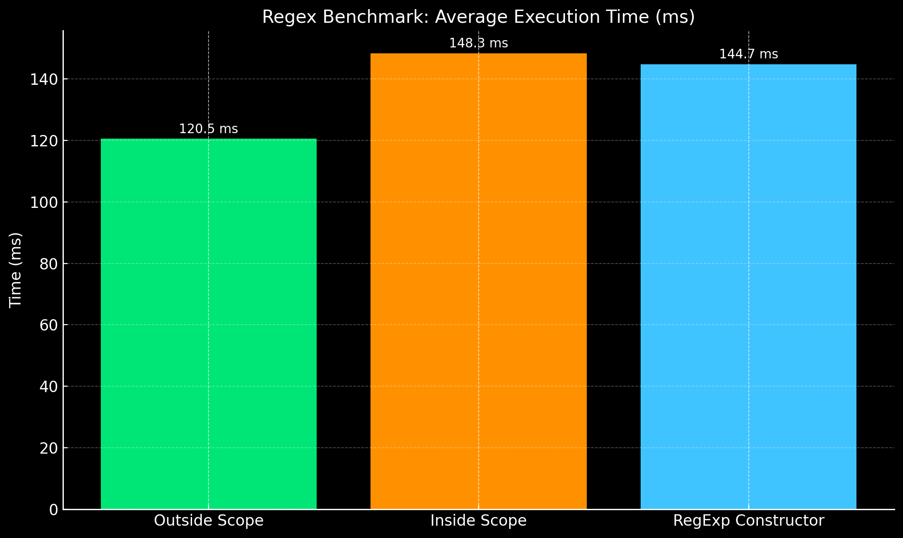

# Regex Scope Benchmark

This project benchmarks the performance difference between using a regular expression defined **outside** vs. **inside** a function scope in JavaScript — including a variation using the `RegExp` constructor.

---

## Description

The script generates a large array of random HTML-like strings and tests them using a regular expression. It compares three approaches:

| Approach                          | Description                                             |
|----------------------------------|---------------------------------------------------------|
| **Outside Function Scope**     | Regex is defined once and reused across all iterations. |
| **Inside Function Scope**      | Regex literal is created on every iteration.            |
| **RegExp Constructor Inside**  | `new RegExp(...)` is created every time.                |

The benchmark calculates:

- **Average execution time** per approach  
- **Absolute and percentage difference** in performance  

---

## Usage

1. Make sure you have [Node.js](https://nodejs.org/) installed.

3. View the summarized results directly in your terminal.

---

## Example Output

summarized results:

Outside function scope: 120.50 ms
Inside function scope: 148.30 ms
RegExp object inside function: 144.70 ms

Difference (Outside vs Inside): 27.80 ms
Difference (Outside vs RegExp): 24.20 ms

Percentage gain over Inside: 18.74%
Percentage gain over RegExp: 16.72%

---

## Notes

- Reusing regular expressions improves performance, especially at scale.
- `new RegExp(...)` performs slightly better than inline literals, but is still slower than reusing a compiled regex.
- For performance-critical code, prefer **declaring your regex once** and reusing it.

